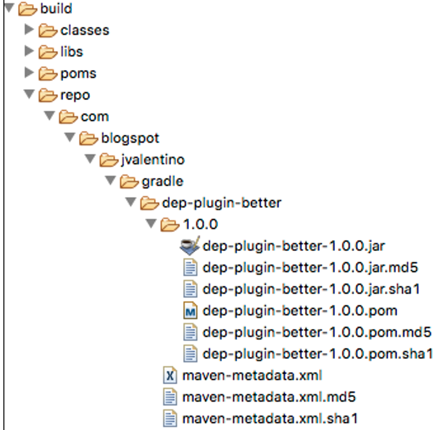

## 4.1 Compile Dependencies

### 4.1.2 Method 2: Probably Better

This project demonstrates another method with manually testing a plugin locally, without having to redundantly declaring the plugin’s compile dependencies in the test project’s classpath. This is accomplished by publishing the plugin Jar and its POM to a local file system-based Maven repository. The plugin project then references that local file system-based Maven repository, which picks up both the Jar and its POM. The inclusion of the POM in this process is what handles the transitive dependencies, specifically the libraries for Apache Common RNG.

 

#### build.gradle

```groovy
version = '1.0.0'
group = 'com.blogspot.jvalentino.gradle'
archivesBaseName = 'dep-plugin-better'

configurations {
    local
}

artifacts {
    archives sourcesJar
    archives javadocJar
    local jar
}

uploadLocal {
    repositories {
        mavenDeployer {
            repository(url: "file://${buildDir}/repo")
        }
    }
}
```

**Line 36: A different Jar name**

A different Jar name is used to differentiate between the first method of dependency management.

 

**Line 38: Configurations**

This method executes the given closure against the **ConfigurationContainer** for this project (https://docs.gradle.org/current/dsl/), which is a collection of different configurations. Each configuration represents a group of artifacts and their dependencies. This is the location where additions from the default, specifically **archives**, are added.

​                

**Line 39: local**

The addition of **local** makes it an available configuration by which artifacts can be associated, as well as tasks that deal with artifacts such as with **upload**.

 

**Line 70: local to jar association**

Within the **artifacts** section configurations can be associated with different artifacts. This line associates the **jar** artifact with the **local** configuration. 

 

**Lines 73-79: uploading to local**

Every configuration has the ability to use several predefined tasks, accessed by the task name followed by the configuration name. The settings for that task can then be modified by declaring a closure of that same name, which is the purpose of **uploadLocal**. The **mavenDeployer** is then set to deploy within the build directory.

 

#### Deploying to local

```bash
dep-plugin-better$ uploadLocal
:compileJava NO-SOURCE
:compileGroovy
:processResources
:classes
:jar
:uploadLocal


BUILD SUCCESSFUL
```

The task **uploadLocal** will result in the Jar being constructed, including its POM, and being placed in **build/repo**. At that location will be the entirety of a Maven repository for hosting this library:



#### plugin-tests/local/build.gradle

```groovy
buildscript {
  repositories {
    maven { url 'file:../../build/repo' }
    jcenter()
  }
  dependencies {
    classpath 'com.blogspot.jvalentino.gradle:dep-plugin-better:1.0.0'
  }
}

apply plugin: 'dep-plugin'
```

**Line 3: The local repo**

The Maven repository uses the file prefix to reference the repository that was created on file system.

#### Manually testing the plugin

```bash
dep-plugin-better/plugin-tests/local$ gradlew random

> Task :random 
RANDOM: 0.8971841709099377


BUILD SUCCESSFUL
```

Using the local repository, the manual test for the build works without having to declare the transitive dependencies for Apache Common RNG.


